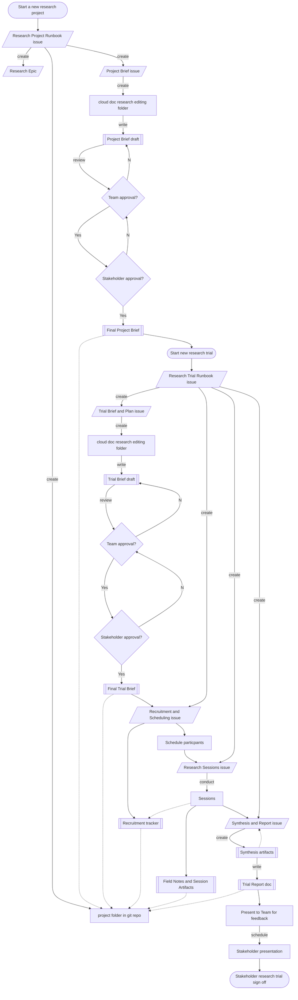

# ResearchOps HackPack

This is a template to get started fast on ux researchOps in an organization.

It's inspired by work produced at the [VA](https://depo-platform-documentation.scrollhelp.site/research-design/) and my own notes and processes accumulated over the years.

This document is to be used by teams that are responsible for UX design and research, and it may be shared with stakeholders to ensure that everyone has a clear understanding of how UX research is managed within the organization.

The purpose of a researchOps repo is to provide a clear and concise overview of the key elements of ux operations, including the roles and responsibilities of different team members, the tools and processes used to manage UX activities, any relevant policies or guidelines that must be followed, and to operationalize those standard processes through smart use of Github project management features, and markdown. By providing this information in a central location, the README can help to ensure that everyone involved in UX operations has the information they need to effectively collaborate and contribute to the success of the product or service.

## Project Structure

- **Product:** the product that your research focuses on.
    - **Project:** a specific area of research you are undertaking on that product, usually this should be organized around a feature epic.
        - **Trial:** the individual iteration of work undertaken as part of a research project. Let's say you want to send out a survey to a large number of users, then interview a subset of those users, then follow up with those users for a second round of interviews to drilldown further, and lastly performing user testing after drafting a prototype: each of these would be it's own trial, organized under a single Project.
            - **Session:**  the individual execution of the trial: IE a specific interview, user test, or card sort session.

## Research Workflow

